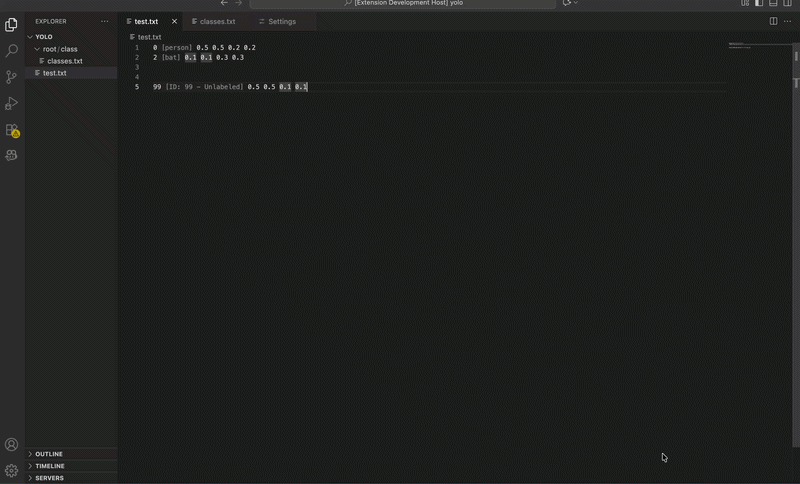

# 🏷️ YOLO Inlay Hints

**YOLO Inlay Hints** is a professional-grade visualization and productivity extension for VS Code, specifically engineered for the **Computer Vision annotation workflow**.

It bridges the gap between raw ML annotation data (**Class IDs**) and human-readable context, enabling **instant validation, navigation, and debugging** within complex annotation datasets.

Designed for high-performance environments, the extension ensures **zero-latency feedback** while working with large multi-folder YOLO datasets.

---

## 🎥 Visual Demo




Example:

```
0 0.512 0.433 0.231 0.123
```

Becomes:

```
0 [person] 0.512 0.433 0.231 0.123
```

---

# 🚀 Key Features

## Contextual Labeling
Instantly maps cryptic **Class IDs** (e.g., `0`) to human-readable labels like:

```
0 → [person]
```

Hints appear dynamically within valid YOLO annotation files.

---

## Intelligent File Discovery

The extension automatically locates your mapping file (`classes.txt`) by:

- Searching upward from the current document
- Performing a workspace-wide parallel scan if necessary

This allows flexible dataset structures without manual configuration.

---

## Jump-to-Definition (Navigation Provider)

Hold:

- **Cmd + Click** (Mac)
- **Ctrl + Click** (Windows / Linux)

on a Class ID to immediately open the **mapping file** at the exact definition line.

---

## Contextual Hover & Metadata

Hover over any inlay hint to view metadata including:

- Class label
- Source mapping file
- Full path of the active mapping file

This helps confirm which dataset configuration is currently active.

---

## Dataset Validation

If a **Class ID is missing from the mapping file**, the extension shows a **Warning Inlay Hint**, allowing instant debugging of annotation integrity.

Example:

```
⚠ Unknown Class ID
```

---

# 🛠️ Technical Architecture

This extension implements **robust, production-grade engineering patterns** suitable for professional ML pipelines.

## Cross-Platform File System API

Uses the **VS Code URI-based filesystem API** (`vscode.workspace.fs`) enabling compatibility with:

- Local environments
- Remote SSH development
- Cloud VMs (Azure / AWS)
- Docker containers
- WSL
- GitHub Codespaces

---

## Race Condition Mitigation

Implements **Cancellation Tokens** to safely cancel background tasks when VS Code requests termination.

This prevents:

- UI lag
- flickering hints
- unnecessary CPU usage during rapid scrolling or file switching

---

## Asynchronous Disk I/O Caching

A **Map-based caching layer** stores file contents in memory, reducing disk reads and ensuring **zero-latency editor interaction**.

---

## Content-Based Validation

A built-in schema validator ensures hints activate **only in valid YOLO annotation files**.

Required format:

```
ClassID X Y Width Height
```

Example:

```
0 0.521 0.433 0.212 0.123
```

---

# ⚙️ Extension Configuration

| Setting | Default | Description |
|-------|-------|-------------|
| `yoloInlayHints.enabled` | `true` | Enable or disable all inlay hints |
| `yoloInlayHints.mappingFileName` | `classes.txt` | Supports custom mapping names (e.g. `labels.txt`, `obj.names`) |
| `yoloInlayHints.showUnlabeledWarning` | `true` | Toggle warning hints for missing class IDs |

---

# 📦 Installation

Install directly from the **VS Code Marketplace**.

1. Open VS Code
2. Go to **Extensions**
3. Search for **YOLO Inlay Hints**
4. Click **Install**

---

# 📁 Usage

1. Open a folder containing YOLO annotation files
2. Ensure a `classes.txt` (or configured mapping file) exists
3. Open any annotation `.txt` file

Hints will appear automatically.

---

## Example Dataset

```
dataset/
│
├─ images/
│   ├─ img1.jpg
│
├─ labels/
│   ├─ img1.txt
│
└─ classes.txt
```

---

# 🧠 Typical Workflow

1. Annotate images using a labeling tool
2. Open the dataset in VS Code
3. Instantly visualize class labels inside annotation files
4. Navigate between labels using **Cmd/Ctrl + Click**

---

# 🤝 Contributing

Contributions are welcome.

If you'd like to improve the extension:

1. Fork the repository
2. Create a feature branch
3. Submit a pull request

---

# 📄 License

MIT License
